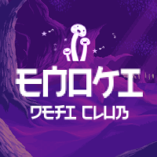

# Enoki Contracts

## Spore Token
Spore tokens are used in the game mechanics of Enoki projects. There is a 230,000 supply. 

* 15,000 is distributed in the Presale
* 5,000 is locked for initial liquidity, to be vested to the Enoki Club DAO over 24 monthes
* 210,000 is locked in the Missions to be distributed in Spore farming pools.

## Spore Pools
Each pool has a distribution rate in SPORE / second. This rate can be halved or doubled by the ENOKI voters via a vote every X blocks. Pools do not mint SPORE, they take it out of the Missions.

## Missions
The Missions hold the spores which are taken by Spore pools when users harvest. When it runs out, no more rewards can be harvested until it is topped up with funds by the Enoki Club DAO.

## Mushroom Factory
When harvesting from Spore pools, users can choose to burn some of their spores for mushrooms. Riskier pools generate stronger mushrooms. The price per mushroom is set in the Pool contract.

## Incubator
Plant your mushrooms in the Incubator to gather ENOKI. Mushrooms have a random lifespan, and once planted this lifespan decreases until the mushroom dies. During it's lifespan it will harvest ENOKI. Once a mushroom has died, remove it from the ground to harvest your ENOKI. If you remove a mushroom before it's lifespan is up, it will retain it's remaining lifespan and can be planted again in the future. 5% of harvested ENOKI is sent to the Dev vesting contract to fund continued development. Each account can plant a maximum of 3 mushrooms at a time. This value can be modified by the DAO governance.

### Mushroom Properties
Each mushroom has the following properties:
* A species. Each pool creates a different species of mushroom.
* A strength, which is based on the species of mushroom. Mushrooms from riskier pools are stronger.
* A lifespan, which is randomly determined within a range for that species when the mushroom in harvested using SPORES.

## Enoki Club DAO
An Aragon DAO that governs the Enoki system. The ENOKI token is the governance token of the Club DAO.

# Architecture Diagrams

# Repo Instructions

## Install & Compile
```
yarn
yarn compile
```
-----

## Testnet

### Start local Testnet
```
yarn run-testnet
```

### Run Tests
```
yarn test
```

### Deploy Testnet
```
yarn deploy-testnet
```
-----
## Mainnet

### Configure Mainnet
* Set .env MNEMONIC and INFURA_URL variables

### Deploy Mainnet
```
yarn deploy-mainnet
```
